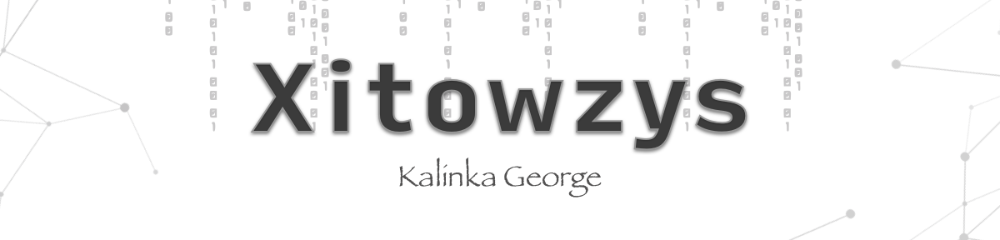

<h2 align="left">👋 Hi I'm Kalinka George </h2>

<h3 align="left"> 📫 How to reach me </h3>

> Please specify in the message that you are with **github**

---

<h3 align="left">📊 Portfolio</h4>

| Project                                                      | Description                                                  |
| ------------------------------------------------------------ | ------------------------------------------------------------ |
|  | All projects while studying at irkutsk state university      |
|  | A library that allows you to automate the process of creating an API Gateway |                                                 |

---

<h3 align="left">💻 Main technology stack:</h3>

<h4 align="left">Languages</h4>

<h4 align="left">Databases</h4>

<h4 align="left">Backend frameworks</h4>

<h4 align="left">Backend tools</h4>

<h4 align="left">Frontend frameworks</h4>

